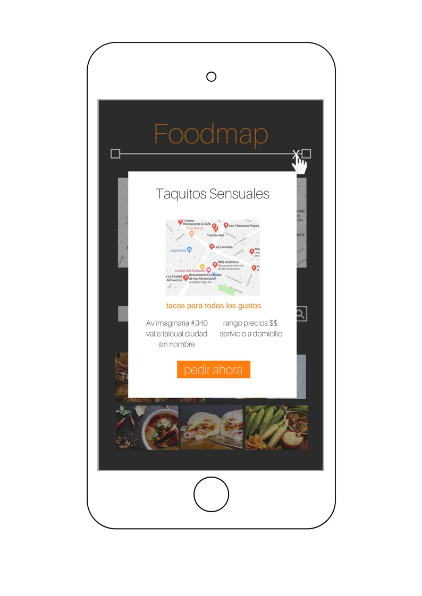
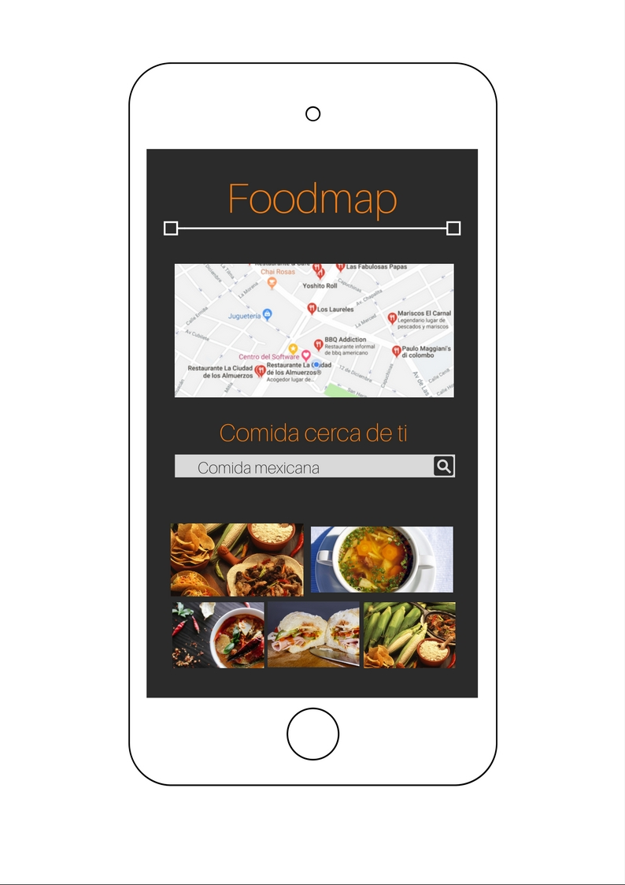

## F O O D M A P

Crear una web-app que a través de un input pueda filtrar los restaurantes que se encuentran cerca.

### Flujo de la aplicación

1. Vista splash con duración de 2 a 5 segundos que redirecciona a tu vista principal.

2. En la vista principal se muestran todos los restaurantes "cerca de ti" junto con el input para filtrar tu elección (Los criterios de filtrado son decisión tuya, puede ser por tipo de comida, costos, orden alfabético, etc.).

3. Ya que se hizo la elección del filtro deben mostrarse únicamente aquellos restaurantes que cumplan con la condición.

4. Al seleccionar alguno de los restaurantes, deberá mostrarse la información de este a través de un modal.

5. Una vez cerrado el modal debe volver a la vista principal.

